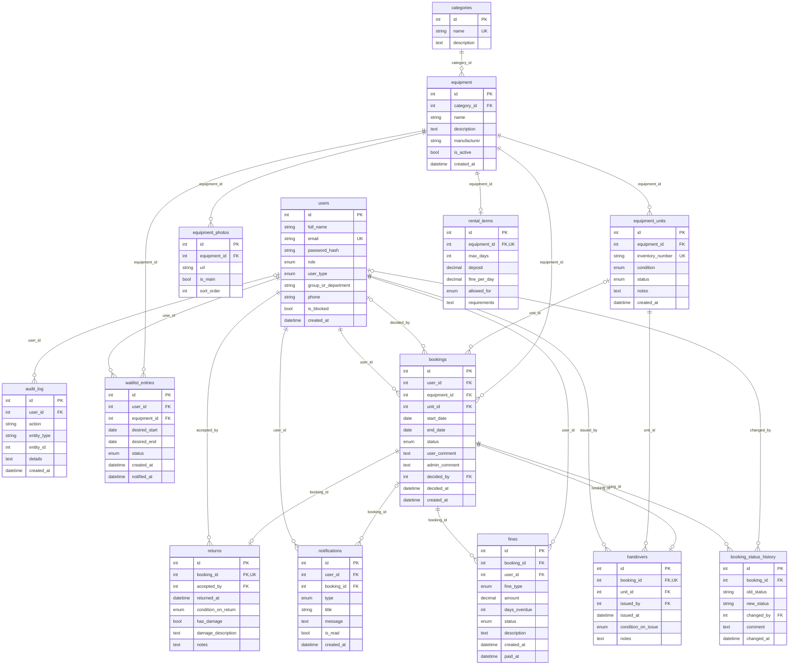

# ER-диаграмма CampusGear

Таблиц: 14. Диаграмма генерируется из моделей командой `python scripts/export_schema.py`.

```mermaid
erDiagram
    users |o--o{ audit_log : "user_id"
    categories ||--o{ equipment : "category_id"
    equipment ||--o{ equipment_photos : "equipment_id"
    equipment ||--o{ equipment_units : "equipment_id"
    equipment ||--o| rental_terms : "equipment_id"
    users ||--o{ waitlist_entries : "user_id"
    equipment ||--o{ waitlist_entries : "equipment_id"
    users ||--o{ bookings : "user_id"
    users |o--o{ bookings : "decided_by"
    equipment_units |o--o{ bookings : "unit_id"
    equipment ||--o{ bookings : "equipment_id"
    bookings ||--o{ booking_status_history : "booking_id"
    users |o--o{ booking_status_history : "changed_by"
    bookings ||--o{ fines : "booking_id"
    users ||--o{ fines : "user_id"
    users ||--o{ handovers : "issued_by"
    equipment_units ||--o{ handovers : "unit_id"
    bookings ||--o| handovers : "booking_id"
    users ||--o{ notifications : "user_id"
    bookings |o--o{ notifications : "booking_id"
    users ||--o{ returns : "accepted_by"
    bookings ||--o| returns : "booking_id"
    categories {
        int id PK
        string name UK
        text description
    }
    users {
        int id PK
        string full_name
        string email UK
        string password_hash
        enum role
        enum user_type
        string group_or_department
        string phone
        bool is_blocked
        datetime created_at
    }
    audit_log {
        int id PK
        int user_id FK
        string action
        string entity_type
        int entity_id
        text details
        datetime created_at
    }
    equipment {
        int id PK
        int category_id FK
        string name
        text description
        string manufacturer
        bool is_active
        datetime created_at
    }
    equipment_photos {
        int id PK
        int equipment_id FK
        string url
        bool is_main
        int sort_order
    }
    equipment_units {
        int id PK
        int equipment_id FK
        string inventory_number UK
        enum condition
        enum status
        text notes
        datetime created_at
    }
    rental_terms {
        int id PK
        int equipment_id FK, UK
        int max_days
        decimal deposit
        decimal fine_per_day
        enum allowed_for
        text requirements
    }
    waitlist_entries {
        int id PK
        int user_id FK
        int equipment_id FK
        date desired_start
        date desired_end
        enum status
        datetime created_at
        datetime notified_at
    }
    bookings {
        int id PK
        int user_id FK
        int equipment_id FK
        int unit_id FK
        date start_date
        date end_date
        enum status
        text user_comment
        text admin_comment
        int decided_by FK
        datetime decided_at
        datetime created_at
    }
    booking_status_history {
        int id PK
        int booking_id FK
        string old_status
        string new_status
        int changed_by FK
        text comment
        datetime changed_at
    }
    fines {
        int id PK
        int booking_id FK
        int user_id FK
        enum fine_type
        decimal amount
        int days_overdue
        enum status
        text description
        datetime created_at
        datetime paid_at
    }
    handovers {
        int id PK
        int booking_id FK, UK
        int unit_id FK
        int issued_by FK
        datetime issued_at
        enum condition_on_issue
        text notes
    }
    notifications {
        int id PK
        int user_id FK
        int booking_id FK
        enum type
        string title
        text message
        bool is_read
        datetime created_at
    }
    returns {
        int id PK
        int booking_id FK, UK
        int accepted_by FK
        datetime returned_at
        enum condition_on_return
        bool has_damage
        text damage_description
        text notes
    }
```
